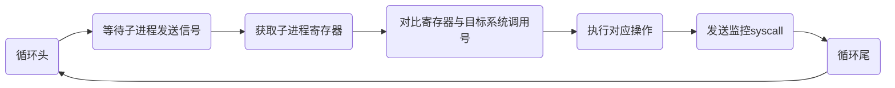

# monitor process io

设计初衷是针对AWD中pwn题，怎么捕获AWD pwn题的交互流量。

AWD题目环境会有很多限制，比如没有给足够的权限捕获网卡流量或者/proc/pid/io的权限。使用chroot修改根目录，修改可执行文件的库，与可用的shell命令。

## 设计思路

参考[pwn_waf](https://github.com/cnitlrt/pwn_waf)的设计，使用父子进程。子进程调用目标程序，并替换自身进程。父进程检测到子进程被替换成目标程序后开始监听子进程的`syscall`，监测到对应的syscall调用号，就执行对应的操作（记录，阻止等）

这样有一个限制，就是如果源程序中的逻辑是ptrace自己，那就没办法办法用父进程去ptrace再去ptrace，毕竟它已经当了自己的爹，没法有第二个爹

```
origin process:

									+-----+
	nc ipaddress port	-------->	| pwn | 
									+-----+

new:
									+---------+
	nc ipaddress port	-------->	| parrent | ----------- ptrace -----------+
									+---------+                               |
									     |                                    |
										 |      +-------+                  +-----+
										 +----> | child | ---- execvp ---- | pwn |
										        +-------+                  +-----+
```

### 子进程替换

子进程替换使用的代码非常简单，使用linux系统的`ptrace::traceme()`，让父进程能够跟踪子进程，然后使用`exec()`启动目标程序就可以替换程序到子进程

```rust
fn child_process() {
    // child process to run the object
    let status;

    status = ptrace::traceme();
    match status {
        Ok(_) => (),
        Err(err) => panic!("Failed to ptrace parent in child process {:?}", err),
    }
    Command::new("./main").exec();
}
```

### 父进程框架



需要监控的系统调用号，存储在config.toml中，在初始化中读取。同时系统调用号对应的操作，以插件的形式在初始化过程中加入程序。

## 插件系统设计

插件系统主要是添加对应系统调用号的处理操作。

### 插件结构定义

### 插件循环遍历

循环遍历查找对应的系统调用

循环对应系统调用号的插件列表，调用插件的接口

```txt
syscall_reg = get_syscall()
for reg in obj_syscalls
	if syscall_reg == reg
		for plugin in plugins[reg]
			plugin.interface(data)
```

## 参考

[cnitlrt/pwn_waf: CTF PWN WAF FOR AWD MODE (github.com)](https://github.com/cnitlrt/pwn_waf)

[linux系统编程之进程（五）：exec系列函数（execl,execlp,execle,execv,execvp)使用 - mickole - 博客园 (cnblogs.com)](https://www.cnblogs.com/mickole/p/3187409.html)

[CommandExt in std::os::unix::process - Rust (rust-lang.org)](https://doc.rust-lang.org/std/os/unix/process/trait.CommandExt.html#tymethod.exec)